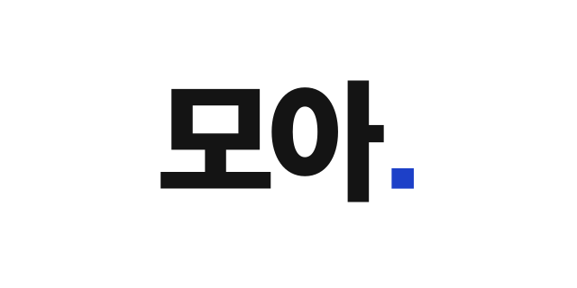
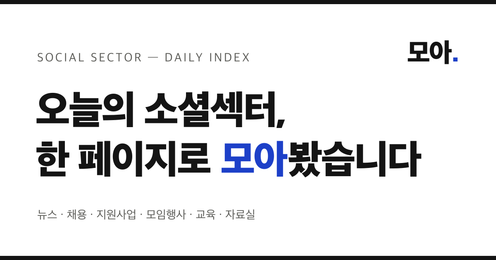

<p align="center">
  
</p>

<h1 align="center">모아 — 소셜섹터 인덱스</h1>

<p align="center">
  한국 소셜섹터(비영리·사회적경제)의 뉴스, 채용, 지원사업, 모임·행사, 교육, 자료를<br>
  매일 자동 수집해 <b>한 페이지</b>로 보여주는 데일리 인덱스.<br>
  <a href="https://moa-social.vercel.app"><b>moa-social.vercel.app</b></a>
</p>

---

## 개발을 몰라도 이해하는 모아

> 이 아래로는 개발 이야기가 많습니다. 이 부분만 읽어도 모아가 무엇이고 어떻게 돌아가는지
> 충분히 이해할 수 있게 풀어 썼습니다.

**한 문장으로.** 소셜섹터 소식이 여기저기 흩어져 있으니, 매일 아침 대신 돌아다니며
스크랩해 한 페이지에 붙여주는 자동 비서입니다.

**어떻게 돌아가나 (비유로).** 부지런한 인턴 한 명이 매일 여러 번, 소셜섹터 매체·재단·정부
사이트 20여 곳을 돌면서 새 소식을 오려 옵니다. 그중 소셜섹터와 상관없는 것(지자체 축제,
대기업 홍보 등)은 버리고, 마감이 급한 것부터 앞에 놓아 벽보처럼 붙입니다. 방문한 사람이
제목을 누르면 원래 기사로 보내줍니다. 이 인턴이 사람이 아니라 프로그램일 뿐입니다.

**자주 나오는 개발 용어, 쉽게 옮기면:**

| 용어 | 쉽게 말하면 |
|---|---|
| RSS | 사이트가 "새 글 나왔어요"라고 자동으로 알려주는 방송. 이걸 켜둔 곳은 수집이 쉽습니다 |
| API | 사이트가 공식적으로 열어둔 데이터 창구. 열쇠(인증키)를 받아 꺼내옵니다 |
| 크롤링 | 방송도 창구도 없는 곳을, 사람이 눈으로 읽듯 프로그램이 페이지를 읽어오는 것 |
| 데이터베이스(DB) | 모아온 소식을 쌓아두는 창고 |
| 배포 | 만든 걸 인터넷에 올려 누구나 주소로 들어올 수 있게 하는 것 |
| 서버·서버리스 | 그 창고와 프로그램이 돌아가는 남의 컴퓨터(클라우드). "서버리스"는 쓴 만큼만 빌리는 방식 |

**무엇이 특별한가.** 소셜섹터에는 이런 "새 글 알림(RSS)"을 제공하는 곳이 드뭅니다. 그래서
구독기로 모아 보기가 어려웠는데, 모아가 그 빈자리를 대신 채웁니다. 넣을 매체를 고르는 것만큼
**엉뚱한 소식을 걸러내는 데** 공을 들였습니다 — 그게 이 서비스의 색을 만듭니다.

**세 갈래로 보실 수 있어요.**

| | 무엇인가 |
|---|---|
| [오늘](https://moa-social.vercel.app/) | 오늘 새로 올라온 소식. 마감 급한 것부터 |
| [아카이브](https://moa-social.vercel.app/archive) | 지난달·지지난달의 기록. 마감돼 원문이 내려간 공고도 여기 남습니다 |
| [모아 픽](https://moa-social.vercel.app/picks) | 두고두고 읽을 만한 글을 골라둔 곳 (인터뷰·커리어·기획) |

**돈과 공개.** 무료 도구만으로 만들어 **운영비 0원**이고, 만든 과정 전체가 이 저장소에
공개돼 있습니다. 소셜섹터에서 비슷한 걸 만들려는 분이 그대로 참고할 수 있게요.

---

## 왜 만들었나

소셜섹터에서 일하는 사람이 하루를 시작하며 봐야 할 정보는 여기저기 흩어져 있습니다.
전문 매체만 여남은 곳이고, 채용은 채용 플랫폼에, 지원사업 공고는 각 재단과 정부 사이트에,
행사와 교육은 뉴스레터 구석에 있습니다. 그런데 이 동네에는 RSS 문화조차 약해서
구독기로 모아 보기도 어렵습니다.

모아는 그 순회를 대신합니다. RSS가 있는 곳은 RSS로, API가 있는 곳은 API로,
둘 다 없는 곳은 크롤링으로 — 매일 여러 번 수집해서 마감 임박한 것부터 보여주고,
클릭하면 원문으로 보냅니다. 제목과 요약만 보여주고 원문으로 연결하는 인덱스이므로
콘텐츠 저작권은 각 출처에 있습니다.

## 디자인 컨셉 — "일간지 1면"

<p align="center">
  
</p>

화려한 카드형 피드 대신 **신문 지면**의 문법을 빌렸습니다. 아침에 한 번,
길게 훑고 닫는 매체라는 점에서 소셜섹터 인덱스는 SNS보다 신문에 가깝기 때문입니다.

- **마스트헤드**: 날짜(DAILY INDEX)와 그날의 지표 — 오늘 새 소식, 이번 주 마감.
  수집 출처 수·전체 건수 같은 운영 지표는 방문자에게 의미가 없어 덜어냈습니다
- **CLOSING SOON 스트립**: 신문의 속보 티커처럼, 카테고리를 가로질러 마감 임박 공고가 흐름
- **텍스트 온리, 대신 색으로 스캔 리듬**: 썸네일 없이 제목·요약·출처·D-day만 담아
  정보 밀도·로딩 속도·원문 존중을 얻습니다. 밋밋함은 이미지가 아니라 **카테고리 색 점**으로 풉니다
- **타이포그래피**: 본문·라벨·출처는 국문 SUIT Variable로 통일하고(모노는 한글에서 글리프가
  갈라져 라벨에 부적합), IBM Plex Mono는 날짜·D-day 같은 순수 숫자 데이터의 신문 조판 악센트로만
- **두 겹의 색 규칙**: 본문은 종이 흰색·잉크 검정(#141414)·코발트(#1D40C8) 3색에 마감 임박(D-5
  이하)의 빨강만 허락합니다. 여기에 **카테고리 식별용 색 팔레트**를 한 겹 더 뒀습니다 —
  뉴스(검정)·채용(코발트)·지원사업(초록)·모임행사(보라)·교육(주황)·자료실(청록).
  색 점 하나 크기라 지면을 어지럽히지 않으면서 스크롤에 리듬을 만듭니다
- **편집 원칙이 곧 정렬 알고리즘**: 같은 날짜 안에서 카테고리와 출처를 번갈아 배치해
  "같은 종류만 주르륵"을 막고, 각 카테고리는 마감 임박한 것부터

로고도 같은 원칙입니다 — 잉크 검정의 "모아"에 코발트 마침표 하나
( 심볼 버전은 `public/symbol.png`).
"오늘 볼 것, 여기 다 모아뒀다"는 문장의 마침표입니다.

## 피드백으로 다듬다

만든 사람은 자기 화면에 익숙해져서 정작 처음 보는 사람이 어디서 걸리는지를 못 봅니다.
그래서 초기에 **마케터 한 분**께 첫인상 피드백을 받아 UI를 다듬었습니다. 받은 지적 여섯 개 중
다섯은 반영했고, 하나(썸네일)는 서비스 정체성과 충돌해 다른 방식으로 풀었습니다.
**피드백은 지시가 아니라 재료입니다** — 증상은 정확히 짚어주지만, 처방은 만드는 사람이 원칙에
비춰 정합니다.

| 마케터의 지적 | Before | After |
|---|---|---|
| "폰트가 제각각이다" | 출처·라벨에 영문 전용 모노 폰트를 써서, 한글엔 글리프가 없어 `홍익지능·AI 리포트`처럼 한 줄에서 폰트가 갈라짐 | 본문 폰트(SUIT)로 통일, 모노는 날짜·D-day 숫자에만 |
| "투데이 날짜가 눈에 안 들어옴" | 작은 회색 모노 한 줄 | 크게·굵게 + 코발트 `TODAY` 배지 |
| "수집 출처·전체 300건이 무슨 의미인지 모르겠다" | 마스트헤드 지표 4개 (운영자 관점 포함) | 방문자에게 의미 있는 2개(오늘 새 소식·이번 주 마감)만 |
| "D-1 같은 게 없는 게 더 깔끔할 듯" | 모든 마감을 코발트로 강조 | 정보는 유지하되 임박(D-5 이하)만 빨강, 나머지는 차분하게 |

**하나는 그대로 반영하지 않았습니다.** *"이미지 썸네일이 없으니 눈이 안 간다"* — 진짜 문제 제기였지만,
남의 기사 이미지를 가져오는 저작권 부담, 절반이 이미지를 안 주는 데이터 현실, 무엇보다 "빠르게
훑는 텍스트 인덱스"라는 정체성을 생각하면 썸네일은 답이 아니었습니다. 대신 **"밋밋하다"는 증상의
진짜 원인(시각적 앵커 부재)**을 카테고리 색 점으로 풀었습니다 — 이미지 없이도 스크롤에 리듬이 생기고,
정체성은 지켰습니다. (덤으로, 이 과정에서 `TechSoup &#038; TAPP`처럼 `&`가 깨지던 인코딩 버그도 잡았습니다.)

## 모바일·크로스브라우저에서 배운 것

트래픽 상당수가 모바일이라 실기기에서 하나씩 부딪히며 고친 함정들입니다. 대부분
"데스크톱 크롬에선 멀쩡한데 폰에서만 이상한" 종류라, 원인과 해법을 남겨둡니다.

| 증상 | 원인 | 해법 |
|---|---|---|
| 폰에서 링크 탭하면 밑줄이 눌러붙음 | 터치 기기의 **sticky hover** — `:hover`가 탭 후에도 유지됨 | 호버 효과를 `@media (hover:hover)`로 감싸 마우스 기기에만 적용 |
| 탭 줄에 세로 스크롤바가 생김 | `overflow-x:auto`를 주면 CSS 규칙상 `overflow-y`도 `auto`가 됨 → 활성 탭 밑줄 2px이 세로 스크롤 유발 | `overflow-y:hidden` 명시 + 밑줄을 컨테이너 안쪽으로 |
| 구독 버튼이 피드 한가운데로 착지 | 앵커(`#nl`) 점프 후 무한스크롤이 위에 항목을 삽입 → 섹션이 밀림. **iOS Safari는 스크롤 앵커링 미지원** | 스크롤 이동 자체를 없애고 **모달**로 전환 |
| 한글이 어절 중간에서 끊김 | 기본 줄바꿈은 음절 단위 | 제목·본문에 `word-break:keep-all` |
| 출처·라벨의 폰트가 갈라져 보임 | 데이터용 영문 모노 폰트에 **한글 글리프가 없어** 폰트가 대체됨 | 한글이 섞이는 곳은 본문 폰트(SUIT), 모노는 순수 숫자에만 |
| 마스트헤드 통계의 구분선이 어긋남 | flexbox + 세로 구분선은 줄바꿈되면 정렬이 깨짐 | 모바일은 `2×2 grid`로, 구분선 대신 간격으로 |
| 좁은 화면에서 푸터 두 줄이 겹침 | 가로 `space-between`이 좁아지면 붙음 | 모바일에선 `flex-direction:column`으로 세로 배치 |

원칙 하나로 요약하면 — **호버·스크롤 앵커링·폰트 폴백처럼 데스크톱에선 안전한 가정이
터치·모바일에선 깨진다.** 그래서 레이아웃이 바뀌는 변경은 반드시 실기기(또는 모바일 뷰포트)에서
한 번 더 확인합니다.

## 데이터 소스

| 방식 | 출처 |
|---|---|
| RSS | 라이프인, 이로운넷(사회연대경제), 더나은미래(공익), 임팩트온(업계소식), 소셜임팩트뉴스, 한국NGO신문(나눔과연대), 웰페어뉴스, 복지타임즈, 웰페어이슈, 아름다운재단(행사·연구보고서), 기부문화연구소, 다음세대재단 |
| 공공 API | 기업마당 지원사업 공고 (소셜섹터 키워드 필터) |
| REST API | 홍익지능 AI 리포트 (WordPress 커스텀 포스트 타입) |
| 크롤링 | 임팩트닷커리어 채용·프로그램, 오렌지레터 최신호(채용/교육·모임/공모·지원/행사), 빠띠 시민대화 모임 |

수집 원칙: robots.txt 준수, 마감 지난 공고 제외, URL·제목 기준 중복 제거,
전체기사 대신 소셜섹터 섹션만 구독(노이즈 방지), 요약에서 바이라인 제거 후 문장 단위로 자르기.

### 매체 선정 기준

모아의 색은 **넣은 매체보다 뺀 매체가 만듭니다.** 기준은 하나 — *"비영리·사회적경제 현장의
소식인가, 아니면 기업 활동을 다루는가."* 이 경계에서 내린 실제 판단들:

- **섹션만 골라 구독** — 이로운넷·더나은미래·임팩트온·한국NGO신문은 전체기사에 지자체 행정,
  대기업 IR, 사건·사고가 섞입니다. 전체 피드 대신 '사회연대경제'·'공익'·'나눔과연대' 같은
  소셜섹터 섹션만 구독해 노이즈를 원천 차단합니다.
- **ESG 매체는 제외** — ESG경제·한경ESG를 검토했으나, ESG 보도는 *"기업이 어떻게 지속가능경영을
  하는가"* 관점이라 우리와 방향이 반대입니다. ESG경제에 소셜섹터 키워드 필터를 걸어보니 65건 중
  5건(8%)만 통과했고 그마저 절반이 기업 사회공헌 홍보였습니다. 수율·품질 모두 낮아 뺐습니다.
- **리브랜딩·휴면 매체 제외** — 데일리임팩트·미디어SR은 경제 매체로 방향을 틀었고,
  루트임팩트 피드는 비어 있어 제외했습니다.
- **판단 방법** — 새 매체는 넣기 전에 실제 기사 제목을 뽑아 키워드 필터를 시뮬레이션해
  "통과 수율"과 "통과한 것의 품질"을 함께 봅니다. 둘 중 하나라도 낮으면 넣지 않습니다.

## 실행

```bash
npm install
npm run dev   # http://localhost:3000
```

환경변수 없이도 동작합니다(실시간 수집 모드). `.env.local.example`을 `.env.local`로
복사해 필요한 키만 채우세요 — 각 키가 없으면 해당 기능만 조용히 꺼집니다.

| 변수 | 용도 |
|---|---|
| `DATABASE_URL` | Postgres 연결(Vercel Storage에서 자동 주입). 없으면 매 렌더링마다 실시간 수집 |
| `CRON_SECRET` | `/api/collect` 수집 엔드포인트 인증 |
| `ADMIN_SECRET` | `/admin?key=…` 관리 페이지 접근 |
| `BIZINFO_API_KEY` | 기업마당 지원사업 API ([신청](https://www.bizinfo.go.kr/apiDetail.do?id=bizinfoApi)) |

## 동작 방식

```
                    ┌─ RSS 12피드 ─────────┐
/api/collect ───────┼─ 기업마당 API ────────┼──→ 중복 제거·차단 필터 ──→ Postgres items
(Cron/Actions 호출)  ├─ 임팩트닷커리어 크롤 ──┤                             │
                    ├─ 오렌지레터 크롤 ─────┤                             ↓
                    └─ 홍익지능 REST ──────┘              홈(ISR 1시간) ← DB 조회
```

- **DB 없음(live 모드)**: 페이지 재생성 때 직접 수집해 바로 보여줌 (데모·로컬용)
- **DB 있음(db 모드)**: 페이지는 DB만 읽어 빠르고, 수집은 뒤에서 —
  ① Vercel Cron 하루 1회(무료 플랜 한도) ② GitHub Actions 하루 5회(`.github/workflows/collect.yml`)
  ③ 방문으로 페이지가 재생성될 때 `after()`로 백그라운드 수집
- 스키마는 수집기가 최초 실행 때 자동 생성 — 수동 SQL 불필요 (`src/lib/db.ts`)
- `/admin?key=ADMIN_SECRET`: 출처별 수집 현황·클릭 통계·구독 신청 목록·항목 삭제.
  삭제한 항목은 `blocked_urls`에 기록되어 재수집되지 않음. 0건 소스는 장애 신호로 표시
- `/rss`: 모아가 수집한 것을 다시 통합 피드로 제공 (원문 링크, 50건)
- 콘텐츠 클릭은 `sendBeacon`으로 기록, 방문·유입경로는 Vercel Web Analytics
- **오늘의 헤드라인**: 최근 이틀 뉴스 중 24시간 클릭 1위를 톱기사로 (없으면 오늘 최신 뉴스).
  분석용으로 모으던 클릭 데이터가 그대로 편집 기능이 됩니다

## 쌓인 콘텐츠를 자산으로 — 아카이브와 픽

수집한 소식은 지우지 않고 전부 DB에 남습니다. 다만 홈은 최근 300건만 보여주므로,
**옛 콘텐츠가 아무 URL에도 없어 검색엔진이 볼 수 없다**는 문제가 있었습니다. 그래서:

- **`/archive`, `/archive/2026-07`** — 월별 아카이브. 그달 수집분 전체를 카테고리별로 정리해
  영구 페이지로 남깁니다. 매달 페이지가 하나씩 늘고 sitemap에 자동 등록되므로,
  **시간이 지날수록 색인 표면적이 커지는 구조**입니다.
  마감 후 원문이 내려가는 공고가 많은 소셜섹터에서는 이 아카이브가 유일한 기록이 되기도 합니다.
- **`/picks`** — 운영자 큐레이션. 좋은 기획·인터뷰·커리어 글을 `/admin`에서 ★픽으로 골라두면
  "오래 남길 글들"로 쌓입니다. 흘러가는 데일리 인덱스와 대비되는, 머무는 공간입니다.

> **검색 노출에 대한 정직한 기대치**: 제목·요약만 싣는 인덱스라 개별 기사 본문 키워드로
> 원문 매체를 이기긴 어렵습니다. 대신 *"2026년 7월 사회적기업 지원사업"* 같은 **시점형·모음형
> 검색**과 **마감돼 사라진 공고**는 모음 페이지가 답이라 우리가 이길 수 있는 영역입니다.

검색 노출을 위한 그 밖의 장치: 카테고리별 실제 URL(`/jobs`, `/grants` …), 동적 sitemap,
구조화 데이터(JSON-LD), AI 검색엔진용 [`llms.txt`](public/llms.txt).

## 구조

```
src/lib/feeds.ts     RSS 피드 목록 (섹션 단위로 노이즈 필터링)
src/lib/rss.ts       RSS 병렬 수집 + 소스별 통계 + 요약 정리(바이라인 제거·문장 단위 자르기)
src/lib/grants.ts    기업마당 지원사업 API
src/lib/jobs.ts      임팩트닷커리어 채용·교육 크롤러
src/lib/orange.ts    오렌지레터 뉴스레터 파서 (sitemap으로 최신호 탐지)
src/lib/parti.ts     빠띠 시민대화 '모임' 게시판 크롤러
src/lib/hiai.ts      홍익지능 리포트 (WP REST API)
src/lib/data.ts      수집 통합·중복 제거·차단 필터·모드 결정 + 아카이브/픽 조회
src/lib/db.ts        Postgres 연결 + 스키마 자동 생성
src/app/page.tsx     메인 (ISR 1시간 + 백그라운드 수집)
src/app/[cat]/       카테고리별 페이지 (/jobs, /grants …)
src/app/archive/     월별 아카이브
src/app/picks/       모아 픽 (큐레이션)
src/app/admin/       관리 페이지 (수집 현황·클릭 통계·픽·삭제)
src/app/api/         collect(수집) · click(클릭 기록) · subscribe(뉴스레터 신청)
src/app/rss/         모아 통합 RSS 출력
```

## 배포 (Vercel 무료 플랜 기준)

1. 이 저장소를 GitHub에서 Vercel로 Import (함수 리전은 `vercel.json`에서 서울 icn1)
2. Storage → Create Database → **Postgres** (DATABASE_URL 자동 주입)
3. 환경변수 `CRON_SECRET`, `ADMIN_SECRET`, `BIZINFO_API_KEY` 등록 후 재배포
4. GitHub 저장소 Secrets에 `APP_URL`(배포 주소), `CRON_SECRET` 등록 → Actions 수집 활성화

## 크롤러 유지보수

크롤링 대상 사이트가 개편되면 해당 소스만 조용히 0건이 됩니다.
`/api/collect` 응답의 `zeroSources` 또는 `/admin` 페이지에서 확인하고
각 파일 상단 주석의 파싱 규칙을 점검하세요.

알려진 한계: 아름다운재단 계열 3개 피드는 Vercel(AWS) 대역에서 간헐적으로 차단됩니다.

---

<p align="center">
  이 서비스는 Claude Code와의 협업으로 하루 만에 기획·개발·배포되었습니다.<br>
  소셜섹터에 작은 보탬이 되기를 바랍니다. 🍊
</p>
